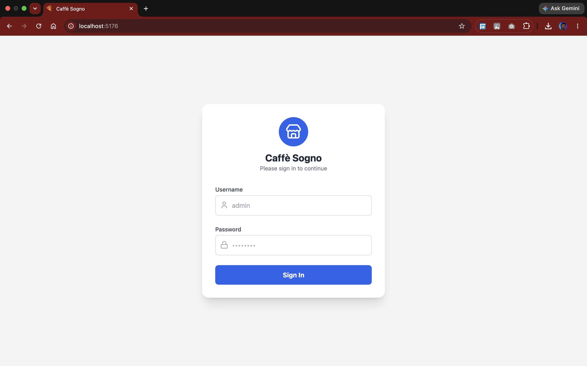
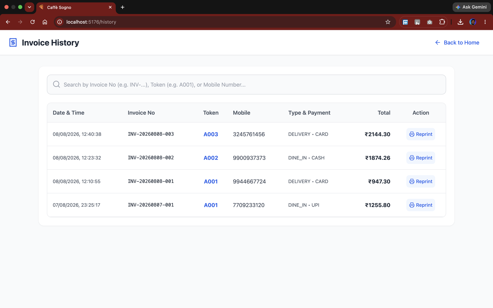

# Pizza POS & Billing System

## About
A full-stack, production-ready Point of Sale (POS) and billing application designed specifically for pizza restaurants. The system features a smart auto-generating 5-digit menu coding scheme, precise dual-tax calculation (CGST/SGST), real-time cart management, and automated 80mm thermal PDF generation for customer invoices and Kitchen Order Tickets (KOT). Built with a clean separation of concerns, it seamlessly handles cashier checkout flows and administrative dashboard management.

---

# Screenshots

## Login Screen


## POS Billing Screen
 *(Note: Replace with your actual image path)*

## Admin Dashboard & Menu Management
 *(Note: Replace with your actual image path)*

## Invoice History Screen


## Thermal Receipt & KOT PDF
 *(Note: Replace with your actual image path)*

---

# Features

## Point of Sale (POS) Engine
- **Smart Menu Search:** Lightning-fast search by name or unique 5-digit item code.
- **Dynamic Cart Math:** Real-time calculation of subtotals, flat delivery charges, and grand totals.
- **Intelligent Taxation:** Automatically applies and splits 5% GST on food and 18% GST on delivery charges into CGST and SGST.
- **Sequential Ticketing:** Auto-generates daily resetting token numbers (e.g., A001, A002) and unique Invoice IDs.

## Document Generation (OpenPDF)
- **Thermal Receipts:** Generates perfectly aligned, borderless PDF invoices optimized for standard 80mm thermal receipt printers.
- **Kitchen Order Tickets (KOT):** Single-click generation of KOTs with large typography, focusing on quantities and item names while omitting pricing for the kitchen staff.

## Admin & Menu Management
- **Auto-Generating Codes:** The system intelligently suggests the next available 5-digit item code based on the selected category prefix.
- **Full CRUD Support:** Add, edit, delete, and toggle active status of menu items directly from the UI without database migrations.
- **Analytics Dashboard:** Tracks today's total sales, completed orders, and payment method distribution (Cash, UPI, Card).

## Invoice History & Retrieval
- **Debounced Search:** Look up past orders instantly using Invoice Number, Token Number, or Customer Mobile Number.
- **Instant Reprinting:** Direct integration with the backend PDF service to reprint lost receipts.

---

# Tech Stack

## Backend & Infrastructure
- Java 17 / 21
- Spring Boot 3.x
- Spring Data JPA
- PostgreSQL
- OpenPDF (Thermal PDF Generation)
- RESTful APIs
- Maven

## Frontend
- React 18
- Vite
- Tailwind CSS 3
- React Router (HashRouter for static hosting compatibility)
- Lucide React (Icons)

## Cloud Deployment
- **Backend:** Hosted on Railway.app
- **Database:** PostgreSQL hosted on Neon.tech
- **Frontend:** Hosted on GitHub Pages

---

# Project Structure

```text
pizza-billing-system/

├── backend/               # Spring Boot Application
│   ├── controller/        # API Endpoints (Auth, Menu, Orders)
│   ├── entity/            # JPA Entities (Order, MenuItem, Category)
│   ├── repository/        # Spring Data JPA Repositories
│   ├── service/           # Business Logic, Tax Math, PDF Generation
│   └── application.properties # Env variables for Neon DB & Railway
│
├── frontend/              # React UI
│   ├── src/
│   │   ├── components/    # PosScreen, AdminDashboard, InvoiceHistory
│   │   ├── App.jsx        # HashRouter Configuration
│   │   └── main.jsx
│   ├── package.json       # Build scripts and gh-pages config
│   └── vite.config.js     # Base path configuration for GitHub Pages
```

---

# API Endpoints

## Menu & Categories
| Method | Endpoint | Description |
| --- | --- | --- |
| GET | `/api/menu` | Fetches all active menu items |
| GET | `/api/menu/search?query=` | Searches menu by 5-digit code or name |
| GET | `/api/menu/next-code?categoryId=` | Auto-calculates next 5-digit sequence |
| POST/PUT | `/api/menu` | Creates or updates a menu item |

## Orders & Billing
| Method | Endpoint | Description |
| --- | --- | --- |
| POST | `/api/orders` | Calculates taxes, saves order, generates tokens |
| POST | `/api/orders/kot` | Generates a transient KOT PDF without saving |
| GET | `/api/orders/{id}/invoice` | Streams the 80mm thermal PDF receipt |
| GET | `/api/orders/history` | Fetches historical orders for reprinting |

## Admin Dashboard
| Method | Endpoint | Description |
| --- | --- | --- |
| POST | `/api/auth/login` | Authenticates cashiers/managers |
| GET | `/api/dashboard/today` | Aggregates daily sales, counts, and payment modes |

# System Architecture Flow

1. **Authentication:** User logs in and is routed to the Home Hub (HashRouter).
2. **Order Building:** Cashier searches items. Frontend state manages cart and preview math.
3. **KOT Generation:** Cashier triggers KOT. Backend generates PDF byte stream, frontend opens browser print dialog.
4. **Checkout:** Order payload sent to backend. Service layer recalculates exact 5% / 18% GST to prevent client-side spoofing.
5. **Database Transaction:** Order, Items, Token (A001), and Invoice Number saved to PostgreSQL.
6. **Receipt Streaming:** Backend instantly returns the saved Order ID, frontend automatically triggers the `/{id}/invoice` endpoint to print the final customer receipt.

---

# Installation & Setup

## Prerequisites

* Java 17+
* Node.js & npm
* PostgreSQL

## Local Setup

1. **Clone Repository**
```bash
git clone [https://github.com/saarv3sh7/pizza-billing-system.git](https://github.com/saarv3sh7/pizza-billing-system.git)
cd pizza-billing-system
```
2. **Database Setup**
Create a PostgreSQL database named `pizza_billing_db`. Update your `application.properties` with your local database credentials.

3. **Start the Backend**
Open the backend folder in IntelliJ IDEA and run the `PizzaBillingApplication` main class. (Runs on port 8080).

4. **Start the Frontend**
```bash
cd frontend
npm install
npm run dev
```
Navigate to `http://localhost:5173`

---

# Future Enhancements

* **Inventory Management:** Automatically deduct stock quantities (e.g., pizza bases, cheese) upon successful checkout.
* **Keyboard Shortcuts:** Implement global hotkeys (e.g., *F1* for search, *F12* for checkout) for lightning-fast cashier operations.
* **JWT Security:** Upgrade the current basic auth to full Spring Security with JWT tokens for API route protection.
* **KOT Display Screen:** Replace the physical KOT PDF printing with a real-time WebSocket display screen inside the kitchen.

---

# Author

Sarvesh Yeutkar

M.Tech CSE (Information Security)  
College of Engineering Pune (COEP)
